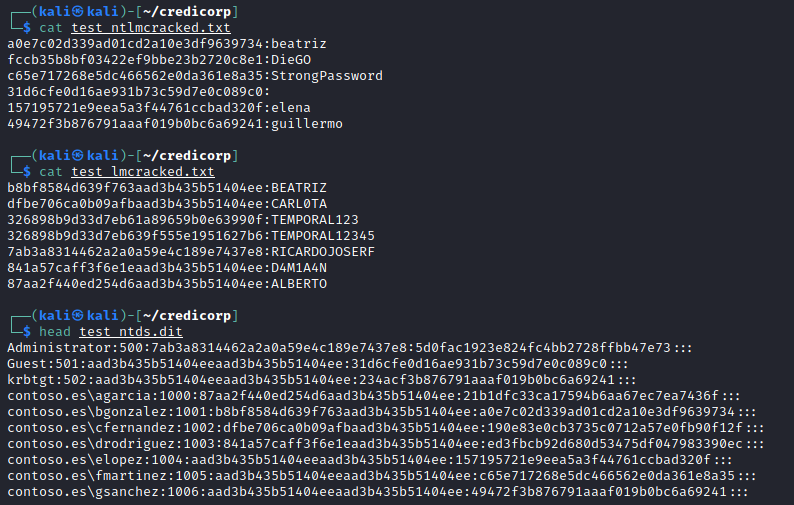
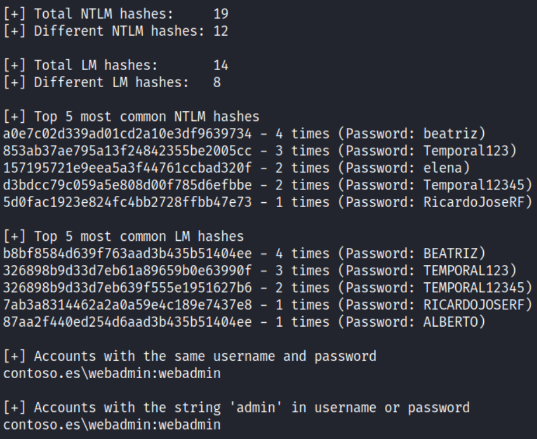
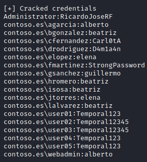
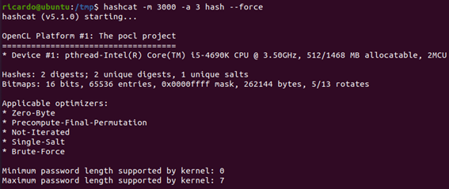

# ntds-analyzer

A script to analyze Ntds.dit files once the NTLM and LM hashes have been cracked. 

Compared to other similar tools, it offers the improvement of calculating the plaintext password when the LM hash has been cracked but not the NTLM (as I explained [in this repository](https://github.com/ricardojoserf/LM_original_password_cracker)). It also offers:

- Top most common NTLM and LM hashes.

- List of compromised accounts using the same username and password.

- List of compromised accounts with the string "admin" in the username or password.

- Percentage of cracked unique and total hashes and accounts.

- Save the list of cracked credentials and NTLM hashes in text files.


-----------------------------------


### Usage

```
python3 analyzer.py -f NTDS.DIT [-n NTLM_CRACKED_HASHES] [-l LM_CRACKED_HASHES] [-m TOP_MOST_COMMON_PASSWORDS] [-d DEBUG]
```

- *-f*: Path of the ntds.dit file

- *-n*: Path of the file with NTLM hashes in *hash:password* format (Optional)

- *-l*: Path of the file with LM hashes in *hash:password* format (Optional)

- *-m*: Number of top most common hashes to show (Optional. Default: 10)

- *-d*: Debug mode to print hashes (Optional. Default: False)

-----------------------------------


### Example

```
python3 analyzer.py -f test_files/ntds.dit -n test_files/ntlm_cracked.txt -l test_files/lm_cracked.txt -m 5 -d 
```

We start with 4 NTLM and 8 LM cracked hashes and the Ntds.dit file:



The script shows the number of hashes and the 5 most common ones because we used *-m 5*; which accounts use the same username and password and which contain the string "admin":



Then it shows the cracked hashes because we used the parameter *-d*. Before we had 4 NTLM hashes cracked and now we have 10! That is because we calculated the password from the related LM hashes and they will be appended to the file "cracked_ntlm.txt":


Finally we get the list of users and their passwords in *user:password* format and the result is appended to the "credentials.txt" file:



In case of not using the *-d* parameter, the hashes would not be printed:


